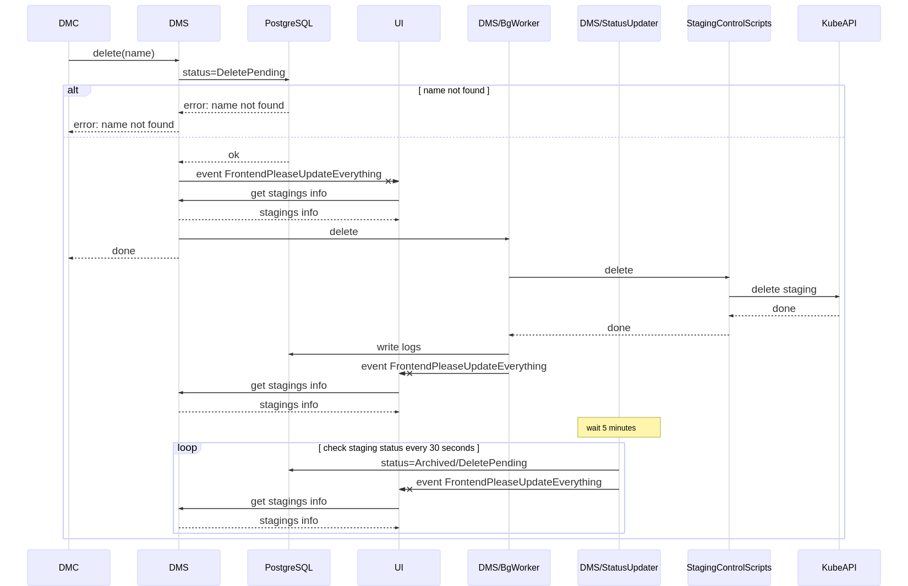
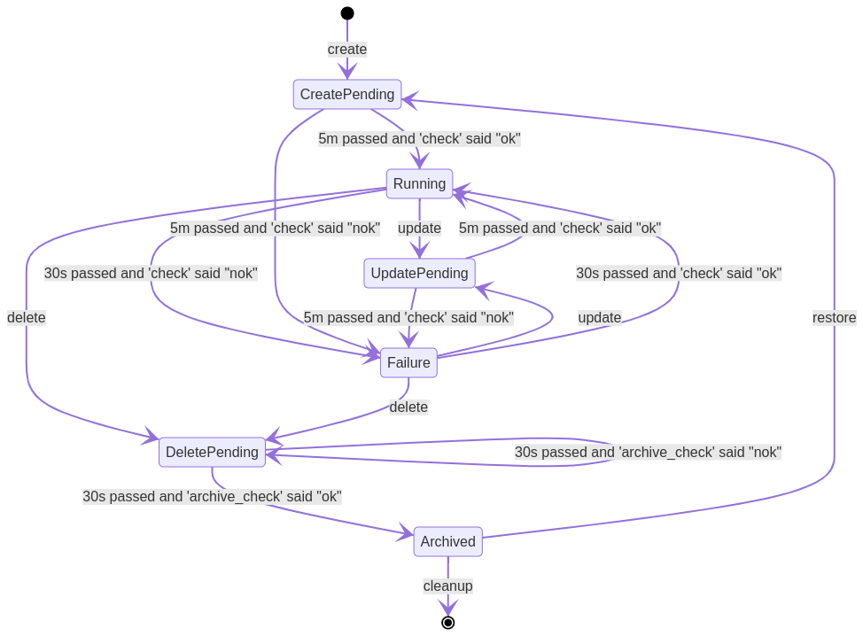

# Technical architecture

  
Table of contents

- [Used tools](#used-tools)
- [App architecture](#app-architecture)
  - [UI](#ui)
  - [DMS](#dms)
  - [PostgreSQL](#postgresql)
  - [DMC](#dmc)
  - [Контейнер с утилитами (staging control scripts)](#контейнер-с-утилитами-staging-control-scripts)
  - [Clean Archive CronJob](#clean-archive-cronjob)
  - [Kube API Server](#kube-api-server)
- [DM Distribution model](#dm-distribution-model)
- [App distribution model. **TODO: Deployment guide link.**](#app-distribution-model-todo-deployment-guide-link)
- [Process view](#process-view)
  - [Create](#create)
    - [Create via CLI](#create-via-cli)
    - [Create via UI](#create-via-ui)
  - [Update](#update)
    - [Update via CLI](#update-via-cli)
    - [Update via UI](#update-via-ui)
  - [Delete](#delete)
    - [Delete via CLI](#delete-via-cli)
    - [Delete via UI](#delete-via-ui)
  - [Cleanup](#cleanup)
    - [Ceanup via CLI](#ceanup-via-cli)
    - [Ceanup via UI](#ceanup-via-ui)
  - [Restore](#restore)
    - [Restore via CLI](#restore-via-cli)
    - [Restore via UI](#restore-via-ui)
- [How we use it](#how-we-use-it)
- [**TODO: Security model link**](#todo-security-model-link)
- [Per staging statuses and status changes](#per-staging-statuses-and-status-changes)

## Used tools

_DM_ разворачивается в [_Kubernetes_](kube) и используется для разворачивания stagings в [_Kubernetes_](kube).

Для хранения настроек и логов действий пользователей используется [_PostgreSQL_](#postgresql).

## App architecture

### UI

_UI_ – веб интерфейс,
используется для управления стейджингами посредством отправки команд управления стейджингами.
Взаимодействует с [_DMS_](#dms) посредством отправки HTTP/1.1 запросов, а также получает
события от [_DMS_](#dms) по _Websocket_. Между _UI_ и [_DMS_](#dms) Basic Auth. Написан на Haskell и Reflex-Dom.

### DMS

_DMS_ – сервер обрабатывает
команды управления стейджингами от [_DMC_](#dmc) и [_UI_](#ui), обновляет состояние стейджингов.
[_DMC_](#dmc) и [_UI_](#ui) взаимодействуют с ним путем отправки HTTP/1.1 запросов.
Сервер шлет событие обновления на [_UI_](#ui) по _Websocket_. Сервер взаимодействует с [_Kube API Server_](#kube-api-server)
через [_контейнер с утилитами (staging control scripts)_](#контейнер-с-утилитами-staging-control-scripts). Для хранения настроек и статусов стейджингов,
и логов действий пользователей используется [_PostgreSQL_](#postgresql). Написан на Haskell. Для работы
со стейджингами использует [_контейнер с утилитами (staging control scripts)_](#контейнер-с-утилитами-staging-control-scripts).

### PostgreSQL

[_PostgreSQL_](https://www.postgresql.org) – РСУБД для хранения настроек и статусов стейджингов, и логов
действий пользователей.

### DMC

_DMC_ – консольный клиент
используется для управления стейджингами посредством отправки команд управления
стейджингами. Взаимодействует с [_DMS_](#dms) посредством отправки HTTP/1.1 запросов.
Написан на Haskell. Между _DMC_ и [_DMS_](#dms) аутентификация по сертификату,
новый сертификаты создается вовремя каждой сборки и упаковываются в контейнеры с _DMC_ и [_DMS_](#dms).

### Контейнер с утилитами (staging control scripts)

_Контейнер с утилитами (staging control scripts)_ – контейнер с исполнямыми файлами, в которые инкапсулирована
логика работы с [_Kube API Server_](#kube-api-server), облачными провайдерами, стейджингами, системами контроля версий и т.д.
Во время старта пода [_DMS_](#dms) содержимое контейнера с утилитами копируется в ФС контейнера с [_DMS_](#dms),
поэтому исполняемые файлы должны быть либо интерпретируемы через _Bash_, либо статически слинкованны.
Логику исполняемых файлов предлагается реализовать пользователям _DM_ (смотри [_Staging control scripts_](Staging_control_scripts.md)).

### Clean Archive CronJob
_Clean Archive CronJob_ – CronJob, которая запускается раз в час и через [_DMC_](#dmc) удаляет заархивированные стейджинги старее 14 дней.

### Kube API Server

[Kube API Server](https://kubernetes.io/docs/concepts/overview/kubernetes-api/) – сервер обрабатывающий HTTP/1.1 запросы. Точка входа для
взаимодействия с [_Kubernetes_](kube).

## DM Distribution model

[_DMC_](#dmc) поставляется упаковынным в Docker образ или в виде статически слинкованного файла (не решили как лучше).

[_DMS_](#dms) и [_UI_](#ui) поставляются упаковынными в один Docker образ. Для развертывания в [_Kubernetes_](kube) используется набор [_Chart_](chart)-ов.

Docker образ [_контейнера с утилитами (staging control scripts)_](#контейнер-с-утилитами-staging-control-scripts) пользователь _DM_ собирает сам.

## App distribution model. **TODO: Deployment guide link.**

## Process view

### Create

_create_ – создание нового стейджинга.
  В качестве аргументов принимаются `name`, `tag` и опциональные `overrides` (уровня App или Staging, открытие или секретные).

#### Create via CLI

#### Create via UI

### Update

_update_ – обновление существующего стейджинга.
  В качестве аргументов принимаются `name`, `tag` и опциональные `overrides` (уровня App или Staging, открытие или секретные).

#### Update via CLI

#### Update via UI

### Delete

_delete_ – архивирование существующего стейджига.
  Производится удаление только подов, Persistent Volumes (диски) сохраняются. Отменить действие этой команды можно с помощью команды restore.
  В качестве аргументов принимаются `name`.

#### Delete via CLI

#### Delete via UI

### Cleanup

_cleanup_ – полная очистка стейджинга.
  Удаление сертификатов, Persistent Volume Claim и Persistent Volumes.
  В качестве аргументов принимаются `name`.

#### Ceanup via CLI

#### Ceanup via UI

### Restore

_restore_ – восстановление заархивированного стейджинга.
  Восстановление заархивированного стейджинга с последними настройками.
  В качестве аргументов принимаются `name`.

#### Restore via CLI

#### Restore via UI

## How we use it

Мы используем несколько кластеров [_Kubernetes_](kube): отдельный кластер для каждого приложения, а так же разделяем по кластерам _production_ и _staging_ окружения.

В каждый _staging_ кластер мы устанавливаем _DM_, через _DM_ осуществляем разворачивание различных версий staging'ов необходимых для QA.

## **TODO: Security model link**

## Per staging statuses and status changes

Существует 6 статусов стейджигов:
1. *Running*
2. *Failure*
3. *CreatePending*
4. *UpdatePending*
5. *DeletePending*
6. *Archived*

_Running_, _Failure_, _Archived_ являются постоянными, т.е. стейджинг уже не находится в режиме выполнения команды.

*CreatePending*, *UpdatePending*, *DeletePending* являются переходными, т.е. стейджинг находится в режиме выполнения команды.

[kubectl]: https://kubernetes.io/docs/reference/kubectl/
[helm]: https://helm.sh
[kubedog]: https://github.com/werf/kubedog
[kube]: https://kubernetes.io
[chart]: https://helm.sh/docs/topics/charts/
